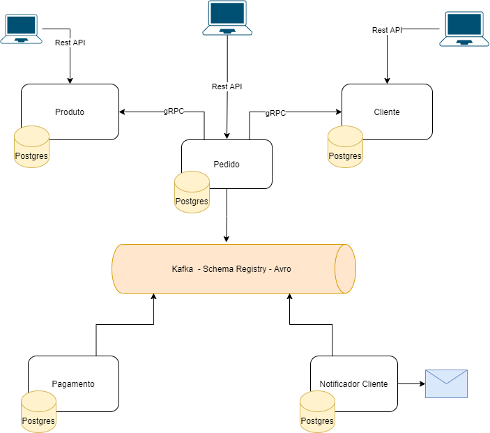

# onurbasfar-stack

### Topologia

### Estudos Alvo
- Kotlin
- Micronaut
- Docker / Docker Compose
- gRPC com protocol buffer
- Kaflka com schema segistry avro
- Open API
- Testes

### Ambições
- Observabilidade
- Kubernet
- Terraform
- Cache
- DynamoDb